# TIPS — Temporal Interview Profiling System

[](https://www.python.org/)
[](https://fastapi.tiangolo.com/)
[](https://aiortc.readthedocs.io/)

TIPS is an automated interview analysis system that processes recorded video interviews, extracts behavioral signals from audio and video, evaluates answer relevance using LLMs, and produces time-evolving candidate scores against job descriptions.

---

## Overview

TIPS combines browser-based interview recording with a multi-stage backend pipeline that processes the interview data:

1. **Interview Recording** — Browser-based video/audio interview via WebRTC with server-side recording
2. **Signal Extraction** — Audio features, video features, and speech-to-text transcription
3. **Temporal Segmentation** — Speaking segments, silence detection, and Q&A pairing
4. **Behavioral Metrics** — Confidence, fluency, eye contact, and response latency
5. **Semantic Scoring** — LLM-powered relevance evaluation against job descriptions
6. **Score Aggregation** — JD-conditioned scoring with chronological accumulation

---

## Architecture

```
┌─────────────────┐     ┌──────────────────┐     ┌─────────────────┐
│   Web UI        │     │  Backend Pipeline │     │   JSON Outputs  │
│ (Recording)     │────▶│  (6-Stage)        │────▶│   (Timeline,    │
│                 │     │                  │     │    Scores, etc) │
└─────────────────┘     └──────────────────┘     └─────────────────┘
```

---

## Tech Stack

### Backend
- **Python 3.11** — Core runtime
- **FastAPI** — Web server framework
- **aiortc** — WebRTC implementation
- **uvicorn** — ASGI server
- **faster-whisper** — Speech-to-text
- **librosa** — Audio feature extraction
- **opencv-python** — Video processing
- **mediapipe** — Face/pose detection
- **transformers + torch** — LLM-based semantic scoring
- **webrtcvad** — Voice activity detection

### Frontend
- **JavaScript** — Client-side WebRTC
- **HTML/CSS** — Interviewer and candidate interfaces

### Infrastructure
- **ffmpeg** — Audio/video processing
- **Git LFS** — Large file storage for recordings

---

## Project Structure

```
├── backend/                 # Interview processing pipeline
│   ├── main.py             # Pipeline orchestration
│   ├── main_1.py           # Alternative orchestration
│   ├── config/             # Configuration module
│   ├── requirements.txt    # Python dependencies
│   ├── src/
│   │   ├── stage0_timebase/      # Time base establishment
│   │   ├── stage1_extraction/    # Signal extraction
│   │   ├── stage2_temporal/      # Temporal segmentation
│   │   ├── stage3_behavior/      # Behavioral metrics
│   │   ├── stage4_semantic/      # Relevance scoring
│   │   └── stage5_aggregation/   # Score aggregation
│   ├── trans/              # Interview recordings input
│   ├── jd/                 # Job descriptions
│   ├── output/             # Pipeline JSON outputs
│   └── results/            # Timestamped results
│
├── web_ui/                 # WebRTC interview interface
│   ├── server.py           # FastAPI WebSocket server
│   ├── index.html         # Landing page (role selection)
│   ├── interviewer.html   # Interviewer control panel
│   ├── candidate.html     # Candidate interface
│   ├── interviewer.js     # Interviewer WebRTC client
│   ├── candidate.js       # Candidate WebRTC client
│   └── recordings/        # Stored interview sessions
│
├── Interview_scripts/      # LaTeX interview question scripts
│   ├── machine_learning_engineer.tex
│   ├── system_architectonic.tex
│   └── product_manager.tex
│
├── README.md
└── .gitattributes
```

---

## Pipeline Stages

| Stage | Name | Description |
|-------|------|-------------|
| 0 | Timebase | Establish canonical time base from video file |
| 1 | Extraction | Extract audio features, video features, and transcriptions |
| 2 | Temporal | Group speaking segments, detect silence, pair Q&A |
| 3 | Behavior | Compute confidence, fluency, eye contact, latency |
| 4 | Semantic | Score answer relevance using LLM against JD |
| 5 | Aggregation | JD-conditioned scoring with chronological accumulation |

---

## Web UI

The web UI provides a browser-based interview interface:

- **Landing Page** — Role selection (Interviewer / Candidate)
- **Interviewer Panel** — Start/control interview, view participant status
- **Candidate Interface** — Camera/microphone selection, local recording backup
- **Server-side Recording** — Captures interviewer audio, candidate audio, and candidate video
- **Dark/Light Theme** — Toggle support

## The Dashboard: An Interface Most Splendid

*Behold! The Dashboard, a panoptic vessel wherein the entirety of the candidate's performance shall be laid bare unto the analyst's discerning eye. From session loading unto detailed Q&A review, this interface presents a comprehensive chronicle of the interview's temporal and semantic dimensions.*

---

### Session Loading

Upon initiating the Dashboard, one encounters first the **Load Session** window, wherein the analyst may selecteth a folder containing the recorded interview artefacts. All files within the chosen directory shall present themselves for examination.


With the folder selected, the files manifest themselves in their fullness, ready for the analyst's scrutiny.

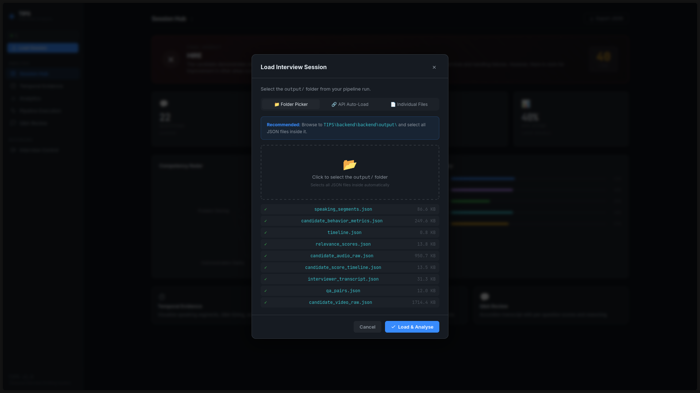

---

### The Session Hub

The **Session Hub** serves as the grand entryway to all analyses. Herein lieth an overview of the entire interview session, presenting the candidate's name, the position sought, and sundry metadata pertaining to the assessment.

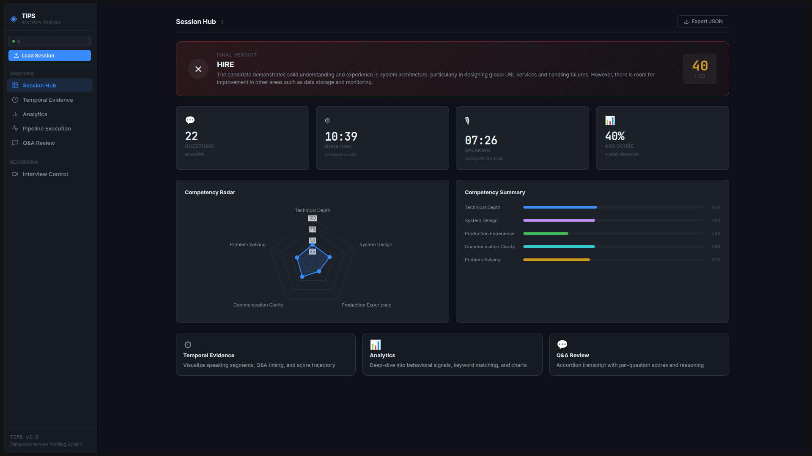

---

### Temporal Evidence

The **Temporal Evidence** section presents a scrolling timeline of all utterances, both from the interviewer and the candidate. Each segment is colour-coded by speaker, allowing the analyst to traverse the interview's chronology with ease.

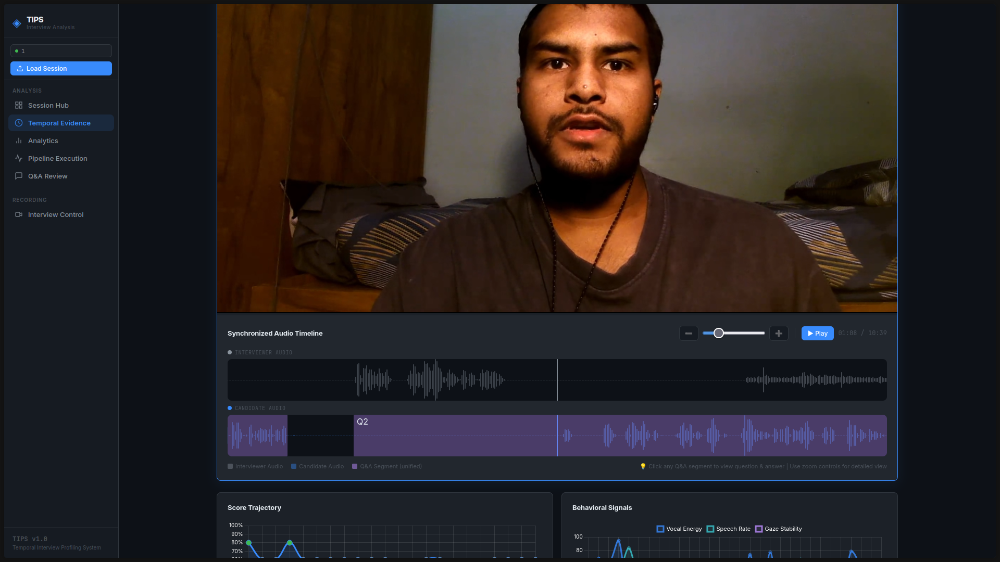

When one clicketh upon a particular segment within the Synchronised Audio Timeline, the video shall reposition itself to that moment, and the transcript shall appear overlaid upon the visual, displaying both question and answer in harmonious concert.

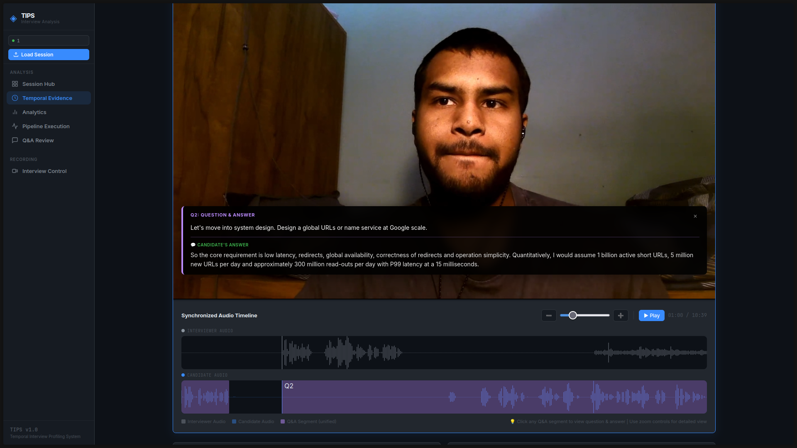

---

### Metrics & Sigils

Beneath the temporal view lie two graphs of great utility:

The **Score Trajectory** graph displayeth the candidate's performance over time, whilst the **Behavioural Signals** panel revealeth three crucial metrics:

1. **Vocal Energy** — The intensity of the candidate's voice
2. **Speech Rate** — The cadence of their utterance
3. **Gaze Stability** — The constancy of their visual attention

Each signal may be toggled on or off at the analyst's pleasure.

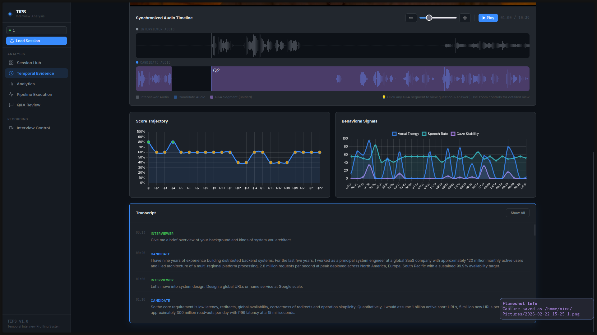

---

### The Analysis Chamber

The **Analysis** section containeth a cornucopia of visualisations:

#### Question-Wise Relevance Score

A bar graph displayeth the relevance score for each question posed, enabling rapid identification of strong and weak responses.

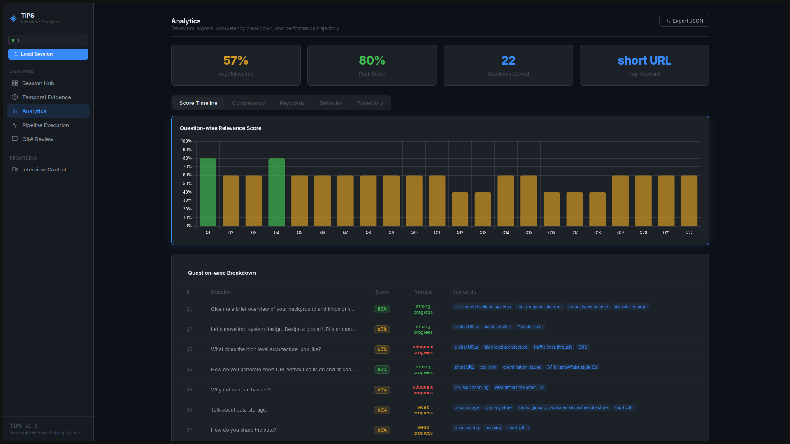

#### Question-Wise Breakdown

Beneath the graph lieth the **Question-Wise Breakdown**, presenting each interrogatory alongside the candidate's response and score in tabular form.

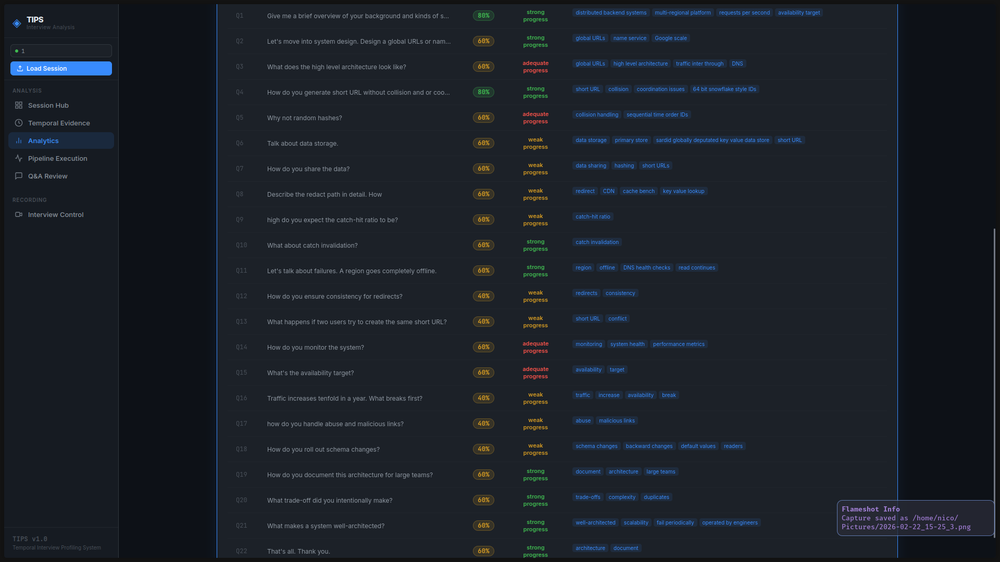

#### Competency Compendium

The **Competency Breakdown** graph presenteth an aggregated view of performance across all competencies, displaying the average score for each.

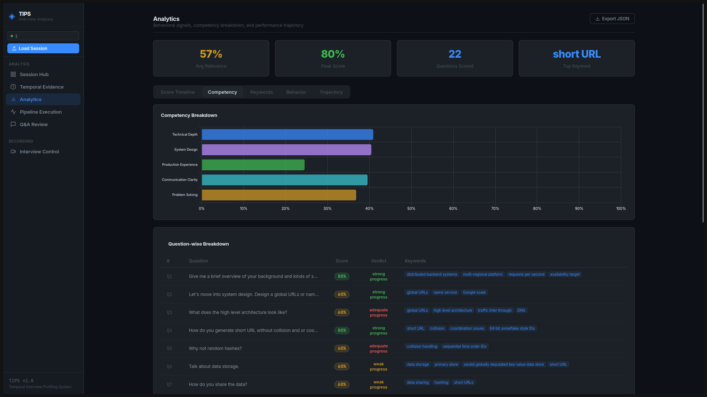

#### The Lexical Heat

The **Keyword Match Heatmap** visualiseth the presence and distribution of key terms from the job description within the candidate's responses.

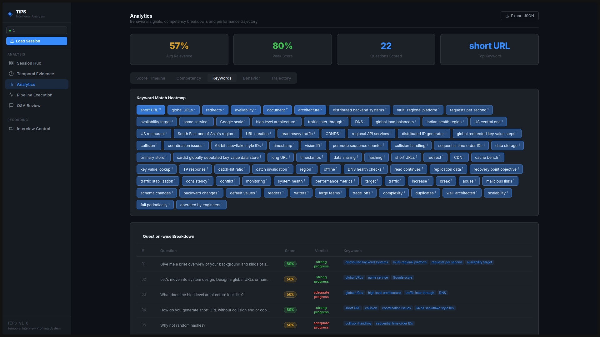

#### Behavioural Distributions

Charts displayeth the distribution of various behavioural metrics, including confidence levels, fluency scores, and response latencies.

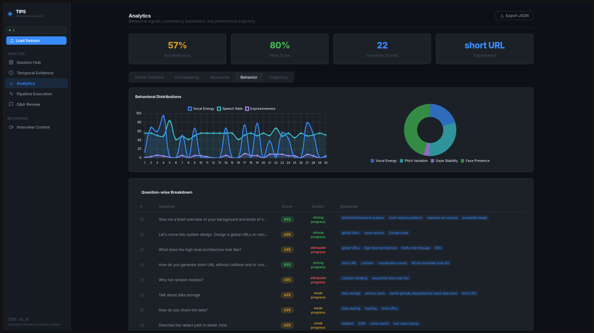

#### Trajectory of Performance

A comprehensive view of how the candidate's performance evolved throughout the interview, from first greeting unto final farewell.

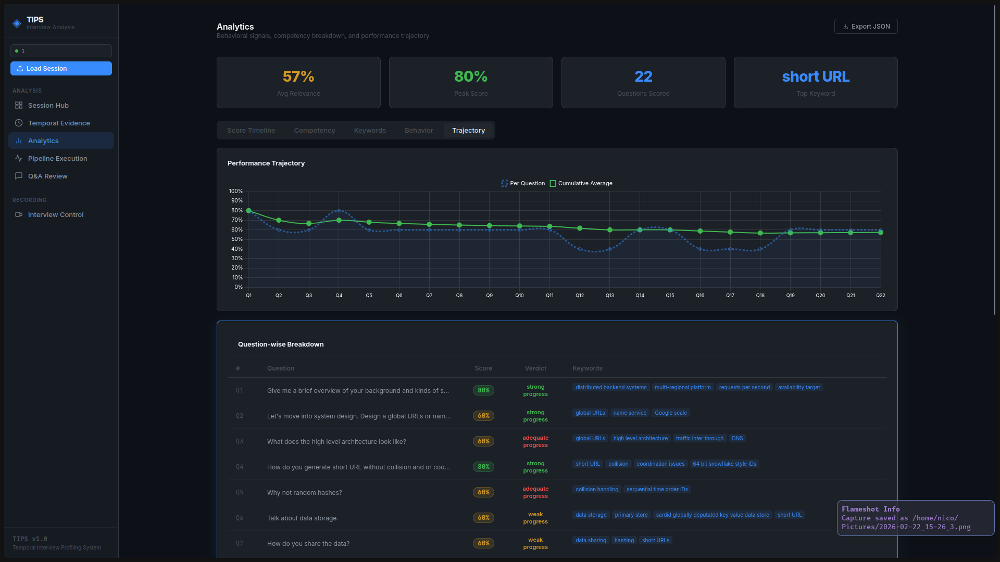

---

### The Great Engine's Pulse

The **Pipeline Execution** section displayeth read-only information regarding the analysis pipeline's progress. The analyst may observe the engine's workings without direct intervention.

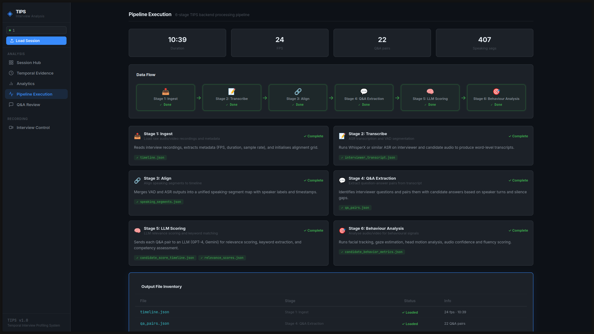

---

### Q&A Review

The **Q&A Review** section presenteth all question-answer pairs in a unified view. Each pair may be expanded to reveal the full details of the interchange.

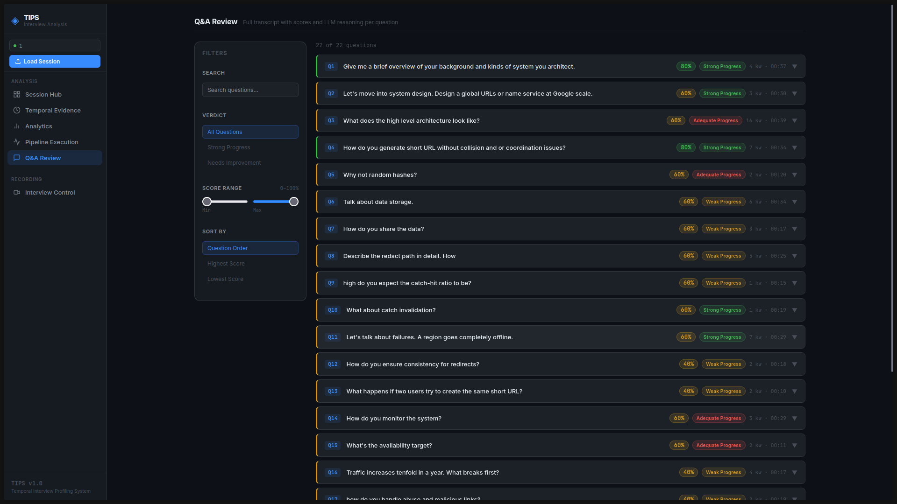

Upon selecting a particular Q&A pair, the analyst may view the complete information: the question posed, the answer rendered, the relevance score assigned, the behavioural metrics observed, and the competency to which that question pertained.

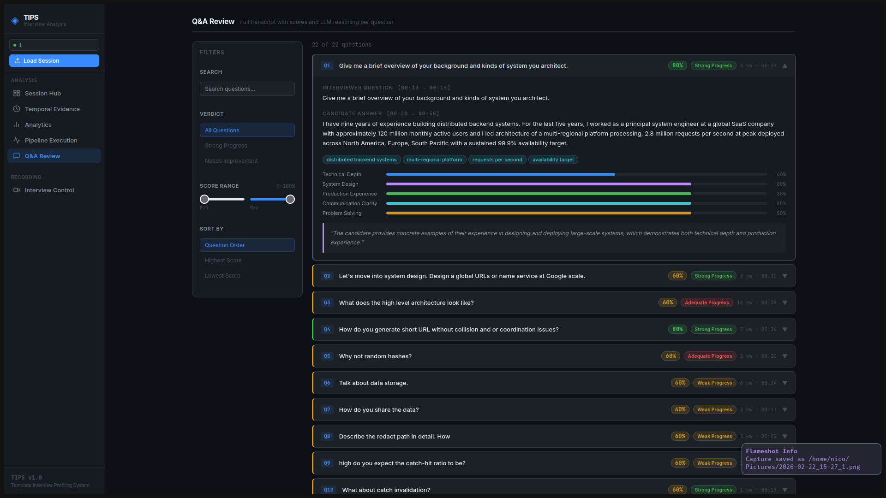

---

### The Recording Chamber

For those requiring the conduct of fresh interviews, the **Recording** section provides a WebRTC-powered interface for capturing candidate responses in real-time. This chamber serves as the gateway to new data for analysis.

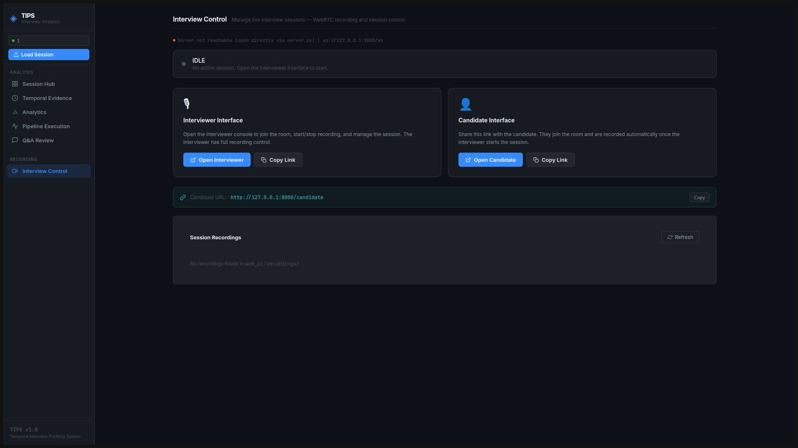

---

*Thus concludes the tour of the Dashboard, a tool of considerable power in the hands of the skilled analyst.*

---

## Interview Scripts

Pre-built LaTeX interview scripts for testing:

- **Machine Learning Engineer** — ML fundamentals, system design, practical applications
- **System Architect** — Distributed systems, scalability, architecture patterns
- **Product Manager** — Product sense, execution, leadership

---

## Setup & Usage

### Backend Setup

```bash
cd backend

# Create virtual environment
python -m venv venv
source venv/bin/activate  # Linux/macOS
# venv\Scripts\activate   # Windows

# Install dependencies
pip install -r requirements.txt

# Run pipeline (requires interview recordings in trans/ and JD in jd/)
python main.py
```

### Web UI Setup

```bash
cd web_ui

# Install Python dependencies
pip install fastapi uvicorn aiortc av

# Start the server
python server.py --host 0.0.0.0 --port 8000

# Open in browser
# Interviewer: http://localhost:8000/interviewer.html
# Candidate:  http://localhost:8000/candidate.html
```

### Quick Test (with sample data)

```bash
# Sample recordings and JDs are included in the repo
cd backend
python main.py
```

---

## Output Artifacts

The pipeline produces JSON files in `backend/output/`:

| File | Description |
|------|-------------|
| `timeline.json` | Master timebase synchronization |
| `candidate_audio_raw.json` | Audio features + transcription |
| `candidate_video_raw.json` | Video frame features |
| `interviewer_transcript.json` | Interviewer speech-to-text |
| `speaking_segments.json` | Speaking vs silence segments |
| `qa_pairs.json` | Question-answer mappings |
| `candidate_behavior_metrics.json` | Behavioral metrics (confidence, fluency, etc.) |
| `relevance_scores.json` | LLM-evaluated relevance scores |
| `candidate_score_timeline.json` | Time-evolving performance scores |

---

## Roadmap

- [x] Interview recording (WebRTC)
- [x] Signal extraction pipeline
- [x] Temporal segmentation
- [x] Behavioral metrics computation
- [x] LLM-powered semantic scoring
- [ ] Dashboard visualization (planned)

---

## License

MIT License

---

## Author

Systems-level exploration of temporal human-computer interaction in interviews.
